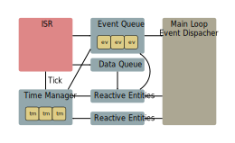

---
tags:
- coding
- c++
- c
- xf
---
# Execution Framework

Execution Framework is also called XF. XF are a collection of services that allow communication and execution of objects and of reactive entities containing state machines. It is an abstraction layer which can be on top of an OS or of an HAL.

Provided services of an XF are:

- Software timers
- Asynchronous inter object communication
- Data buffers and queues
- Memory management

## Overview

{.center width="700px"}

### ISR

The ISR will generate different kind of events. The Tick timer events are essential because the whole system is based around the Tick. But other interrupts enables peripherals will generate different kind of events and place in the event queue or data queue e.g. UART.

### Time Manager

The time manager allows generating timing events to place in the event queue. It allows an, depending on the hardware, unlimited amount of software timers. The time manager holds all software timers in a FIFO. The timer which ends first is at the top of the fifo. Once a timer reaches zero a timer event is places in the event queue.

### Event Queue

The event queue is a FIFO of all given event. An event can also hold some data if necessary.

### Data Queue

With help of the data queue, the reactive entities can exchange data.

### Reactive Entities

Reactive entities are nothing else than state machines. They are always in a certain state and are triggered to go into the next state by events. Depending on the hardware multiple state machines can run at the same time.
### MainLoop / Event Dispatcher

The event dispatcher only reads the event at the top of the FIFO and calls all observers subscribed to that event type. Once an event is processed the next event will be read.

## Observer Pattern

One way to exchange informations is via the Observer - Subject Pattern. The subject, maintains a list of its dependents, called observers, and notifies them automatically of any state changes, usually by calling their method `update`.

- All Observers are attached to the Subject
- If something happens with the Subject his `_notify()` will be called
- The `_notify()` will call the `update()` method of all attached Observers

### Subject

Multiple Observers can be attached to an Subject and get notified when something interesting happens.

``` cpp
virtual void attach ( Observer * pObserver , uint8_t index = 0 ) = 0 ;
```

Informs the observer(s) that something of interest happened to the Subject

``` cpp
virtual void _notify ( uint8_t index = 0 ) = 0 ;
```

### Observer

Informs the observer that something of interest happened to its Subject (called by the notify() method of the Subject)

``` cpp
virtual void update ( Subject * pSubject = 0 ) = 0 ;
```
