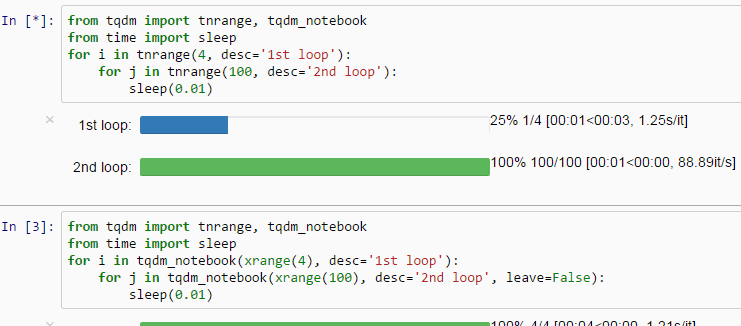

---
tags:
- coding
- python
- packages
- tqdm
---
# TQDM

tqdm derives from the Arabic word taqaddum (تقدّم) which can mean "progress," and is an abbreviation for "I love you so much" in Spanish (te quiero demasiado).

Instantly make your loops show a smart progress meter - just wrap any iterable with tqdm(iterable), and you're done!

- [TQDM Github](https://github.com/tqdm/tqdm)
- [TQDM RTD](https://tqdm.github.io)

## Install

``` bash
pip install tqdm
```

## Usage

### trange

``` python
from tqdm import trange
from time import sleep

for i in trange(100, desc='pb1'):
  sleep(0.01)

for i in trange(100, desc='pb2', ascii=True):
  sleep(0.01)

for i in trange(100, desc='pb3', ncols=50):
  sleep(0.01)

for e in tqdm([1,2,3,4,5,6,7,8,9]):
  sleep(0.01)
```

``` bash
pb1:  21%|████████▍                               | 21/100 [00:21<01:19,  1.00s/it]
pb2:  20%|########                                | 20/100 [00:20<01:20,  1.00s/it]
pb3:  32%|██▏    | 32/100 [00:12<00:27,  2.49it/s]
50%|███████████████████                               | 5/9 [00:18<00:32,  2.00it/s]
```

### in jupyter

``` python
from tqdm import tnrange, tqdm_notebook
from time import sleep
for i in tnragne(4, desc='1st loop'):
  for j in tnrange(100, desc='2nd loop'):
    sleep(0.01)
```

{.center width="70.0%"}

``` python
from tqdm import tnrange, tqdm_notebook
from time import sleep
for i in tnragne(4, desc='1st loop'):
  for j in tnrange(100, desc='2nd loop', leave=False):
    sleep(0.01)
```

{.center width="70.0%"}
