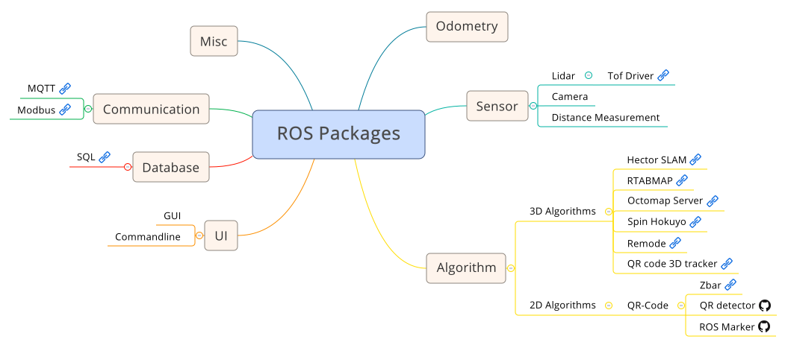

---
tags:
- coding
- ros
---
# External Packages and Nodes
## Terminology

- `+` : interesting topics and hardware abstraction
- `~` : interesting, but quite a lot of work to do for hardware compatibility or mapping
- `-` : bad solution

## Overview

## 3D Mapping
### SLAM
#### Octomap_server : `+`

3D occupancy grid mapping, independent from sensor, looks like it does not need odometry

- [https://youtu.be/yp0f8-AKvDU](https://youtu.be/yp0f8-AKvDU)
- [https://wiki.ros.org/octomap_mapping](https://wiki.ros.org/octomap_mapping)
- [https://wiki.ros.org/octomap_server](https://wiki.ros.org/octomap_server)
- [http://octomap.github.io/](http://octomap.github.io/)

Plus :

- maintained
- compatible with melodic
- documentation available as well as many
- no odometry
- independent from hardware (only require the right input topics)

Minus :

- ...

Inputs required :

- sensor_msgs/PointCloud2

#### Hector slam : `+`

- [https://github.com/tu-darmstadt-ros-pkg/hector_slam](https://github.com/tu-darmstadt-ros-pkg/hector_slam)
- [http://wiki.ros.org/hector_slam](http://wiki.ros.org/hector_slam)

Not sure whether we're interested in hector slam itself, or on the

Plus :

- maintained
- not directly compatible with melodic, but easy to build it from source for melodic
- odometry not needed

Minus :

- mostly created for 2D mapping and robot navigation
- not much documentation

Inputs required :

- ...

#### REMODE : `~`

- [https://www.ros.org/news/2016/02/open-source-release-remode-probabilistic-monocular-dense-reconstruction-in-real-time.html](https://www.ros.org/news/2016/02/open-source-release-remode-probabilistic-monocular-dense-reconstruction-in-real-time.html)

modeling of many 3D objects, like rooms, persons, \...

Plus :

- noise reduction
- nice rendering

Minus :

- not much documentation and precisions about `hardware/drivers/topics`
- maybe "too much" for our needs ?
- looks like it is not maintained anymore : latest commit was 4 years ago

Inputs :

-   ...

### LOAM
#### RTABMAP : `+`

- [http://wiki.ros.org/rtabmap_ros](http://wiki.ros.org/rtabmap_ros)

Plus :

- maintained
- compatible with melodic
- real time mapping
- publishes :
  - 3D point clouds
  - 2D occupancy maps
- tutorials and documentation available

Minus :

- oriented towards robot navigation, although "top-down" modeling seems to be possible

Inputs required :

- odometry (not mandatory in all cases)
- scan 2D or 3D

#### Spin Hokuyo : `+`

- [https://github.com/RobustFieldAutonomyLab/spin_hokuyo](https://github.com/RobustFieldAutonomyLab/spin_hokuyo)
- [http://wiki.ros.org/spin_hokuyo](http://wiki.ros.org/spin_hokuyo)

It creates a point cloud with a 2D LiDaR and a servomotor. The
interesting node compiles small point clouds to make one big point
cloud. Could be very useful to make our digital model.

Plus :

- has a node that compiles point clouds and publish them on a topic
- great rendering

Minus :

- designed for another sensor, but the node that compiles point clouds does not care about that
- need some odometry work

Inputs required :

- laser scan
- odometry

#### Lego-LOAM : `~`

- [https://github.com/RobustFieldAutonomyLab/LeGO-LOAM](https://github.com/RobustFieldAutonomyLab/LeGO-LOAM)

Plus :

- good rendering

Minus :

- designed for robot navigation, not for "top-down mapping"
- designed for another sensor (velodyne)

Inputs :

- ...

#### Velodyne loam : `~`

- [http://wiki.ros.org/loam_velodyne](http://wiki.ros.org/loam_velodyne)

Plus :

- good rendering
- builds 3D maps

Minus :

- for velodyne sensor
- robot navigation

Inputs :

- ..

### Bad solution `-`

- [https://github.com/koide3/hdl_graph_slam](https://github.com/koide3/hdl_graph_slam) : not what we need. creates maps with corridors and doors, but not "top-down" mapping
- [http://wiki.ros.org/robot_pose_ekf](http://wiki.ros.org/robot_pose_ekf) : not what we need
- [http://wiki.ros.org/ethzasl_icp_mapper](http://wiki.ros.org/ethzasl_icp_mapper) : doc not up to date, slowly not maintained anymore, ...
- [https://github.com/ethz-asl/libpointmatcher/blob/master/doc/index.md](https://github.com/ethz-asl/libpointmatcher/blob/master/doc/index.md)

## Modbus

- [http://wiki.ros.org/modbus](http://wiki.ros.org/modbus)

## Object Tracking
### Multiple objects lidar tracking : `~`

- [https://github.com/praveen-palanisamy/multiple-object-tracking-lidar](https://github.com/praveen-palanisamy/multiple-object-tracking-lidar)

Plus :

- tracks objects in real time
- hardware independent

Minus :

- 2D maps, most likely used for robot navigation

Inputs :

- ...

## Object Detection

- [https://www.acin.tuwien.ac.at/vision-for-robotics/software-tools/v4r-library/](https://www.acin.tuwien.ac.at/vision-for-robotics/software-tools/v4r-library/)
- [https://rgit.acin.tuwien.ac.at/v4r/v4r_ros_wrappers](https://rgit.acin.tuwien.ac.at/v4r/v4r_ros_wrappers)
- [http://wiki.ros.org/object_recognition](http://wiki.ros.org/object_recognition)
- [https://www.osrfoundation.org/ros2-object-detection-demo/](https://www.osrfoundation.org/ros2-object-detection-demo/)
- [http://wiki.ros.org/find_object_2d](http://wiki.ros.org/find_object_2d)

## QR code readers

- [http://wiki.ros.org/zbar_ros](http://wiki.ros.org/zbar_ros)
- [https://github.com/mdrwiega/qr_detector](https://github.com/mdrwiega/qr_detector)
- [http://wiki.ros.org/visp_auto_tracker](http://wiki.ros.org/visp_auto_tracker)
