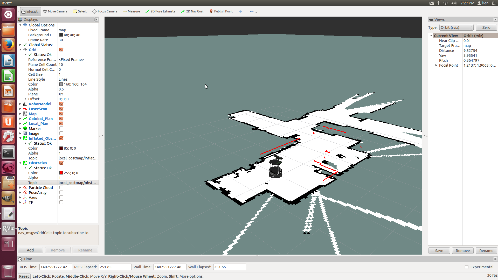

---
tags:
- coding
- ros
- rviz
---
# RViz

## Overview

[http://wiki.ros.org/rviz](http://wiki.ros.org/rviz)

- 3D visualization tool for ROS
- Subscribes to topics and visualizes the message contents
- Different camera views (orthographic, top-down, etc.)
- Interactive tools to publish user information
- Save and load setup as RViz configuration
- Extensible with plugins

## Run

``` bash
rosrun rviz rviz
```

{.center}

Save configuration with `ctrl+s`

## Built-In Display Types

| Name                                                                            | Description                                                                                                                              | Messages Used
| ------------------------------------------------------------------------------- | ---------------------------------------------------------------------------------------------------------------------------------------- | --------------------------------------------------------------------------------------------------------------------
| [Axes](https://wiki.ros.org/rviz/DisplayTypes/Axes)                             | Displays a set of Axes                                                                                                                   | |
| [Effort](https://wiki.ros.org/rviz/DisplayTypes/Effort)                         | Shows the effort being put into each revolute joint of a robot.                                                                          | [sensor_msgs/JointStates](http://docs.ros.org/api/sensor_msgs/html/msg/JointStates.html) |
| [Camera](https://wiki.ros.org/rviz/DisplayTypes/Camera)                         | Creates a new rendering window from the perspective of a camera, and overlays the image on top of it.                                    | [sensor_msgs/Image](http://docs.ros.org/api/sensor_msgs/html/msg/Image.html), [sensor_msgs/CameraInfo](http://docs.ros.org/api/sensor_msgs/html/msg/CameraInfo.html) |
| [Grid](https://wiki.ros.org/rviz/DisplayTypes/Grid)                             | Displays a 2D or 3D grid along a plane                                                                                                   | |
| [Grid Cells](https://wiki.ros.org/rviz/DisplayTypes/GridCells)                  | Draws cells from a grid, usually obstacles from a costmap from the [navigation](https://wiki.ros.org/navigation) stack.                  | [nav_msgs/GridCells](http://docs.ros.org/api/nav_msgs/html/msg/GridCells.html) |
| [Image](https://wiki.ros.org/rviz/DisplayTypes/Image)                           | Creates a new rendering window with an Image. Unlike the Camera display, this display does not use a CameraInfo. *Version: Diamondback+* | [sensor_msgs/Image](http://docs.ros.org/api/sensor_msgs/html/msg/Image.html) |
| [InteractiveMarker](https://wiki.ros.org/rviz/DisplayTypes/InteractiveMarker)   | Displays 3D objects from one or multiple Interactive Marker servers and allows mouse interaction with them. *Version: Electric+*         | [visualization_msgs/InteractiveMarker](http://docs.ros.org/api/visualization_msgs/html/msg/InteractiveMarker.html) |
| [Laser Scan](https://wiki.ros.org/rviz/DisplayTypes/LaserScan)                  | Shows data from a laser scan, with different options for rendering modes, accumulation, etc.                                             | [sensor_msgs/LaserScan](http://docs.ros.org/api/sensor_msgs/html/msg/LaserScan.html) |
| [Map](https://wiki.ros.org/rviz/DisplayTypes/Map)                               | Displays a map on the ground plane.                                                                                                      | [nav_msgs/OccupancyGrid](http://docs.ros.org/api/nav_msgs/html/msg/OccupancyGrid.html) |
| [Markers](https://wiki.ros.org/rviz/DisplayTypes/Marker)                        | Allows programmers to display arbitrary primitive shapes through a topic                                                                 | [visualization_msgs/Marker](http://docs.ros.org/api/visualization_msgs/html/msg/Marker.html), [visualization_msgs/MarkerArray](http://docs.ros.org/api/visualization_msgs/html/msg/MarkerArray.html) |
  [Path](https://wiki.ros.org/rviz/DisplayTypes/Path)                             | Shows a path from the [navigation](https://wiki.ros.org/navigation) stack.                                                                | [nav_msgs/Path](http://docs.ros.org/api/nav_msgs/html/msg/Path.html) |
  [Point](https://wiki.ros.org/rviz/DisplayTypes/Point)                           | Draws a point as a small sphere.                                                                                                          | [geometry_msgs/PointStamped](http://docs.ros.org/api/geometry_msgs/html/msg/PointStamped.html) |
  [Pose](https://wiki.ros.org/rviz/DisplayTypes/Pose)                             | Draws a pose as either an arrow or axes.                                                                                                  | [geometry_msgs/PoseStamped](http://docs.ros.org/api/geometry_msgs/html/msg/PoseStamped.html) |
  [Pose Array](https://wiki.ros.org/rviz/DisplayTypes/PoseArray)                  | Draws a "cloud" of arrows, one for each pose in a pose array                                                                              | [geometry_msgs/PoseArray](http://docs.ros.org/api/geometry_msgs/html/msg/PoseArray.html) |
  [Point Cloud(2)](https://wiki.ros.org/rviz/DisplayTypes/PointCloud)             | Shows data from a point cloud, with different options for rendering modes, accumulation, etc.                                             | [sensor_msgs/PointCloud](http://docs.ros.org/api/sensor_msgs/html/msg/PointCloud.html), [sensor_msgs/PointCloud2](http://docs.ros.org/api/sensor_msgs/html/msg/PointCloud2.html) |
  [Polygon](https://wiki.ros.org/rviz/DisplayTypes/Polygon)                       | Draws the outline of a polygon as lines.                                                                                                  | [geometry_msgs/Polygon](http://docs.ros.org/api/geometry_msgs/html/msg/Polygon.html) |
  [Odometry](https://wiki.ros.org/rviz/DisplayTypes/Odometry)                     | Accumulates odometry poses from over time.                                                                                                | [nav_msgs/Odometry](http://docs.ros.org/api/nav_msgs/html/msg/Odometry.html) |
  [Range](https://wiki.ros.org/rviz/DisplayTypes/Range)                           | Displays cones representing range measurements from sonar or IR range sensors. *Version: Electric+*                                       | [sensor_msgs/Range](http://docs.ros.org/api/sensor_msgs/html/msg/Range.html) |
  [RobotModel](https://wiki.ros.org/rviz/DisplayTypes/RobotModel)                 | Shows a visual representation of a robot in the correct pose (as defined by the current TF transforms).                                   | |
  [TF](https://wiki.ros.org/rviz/DisplayTypes/TF)                                 | Displays the [ros wiki tf](https://wiki.ros.org/tf) transform  hierarchy.                                                                 | |
  [Wrench](https://wiki.ros.org/rviz/DisplayTypes/Wrench)                         | Draws a wrench as arrow (force) and arrow + circle (torque)                                                                               | | [geometry_msgs/WrenchStamped](http://docs.ros.org/api/geometry_msgs/html/msg/WrenchStamped.html)
  [Oculus](https://wiki.ros.org/oculus_rviz_plugins)                              | Renders the RViz scene to an Oculus headset                                                                                               | | 