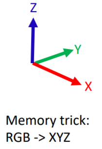
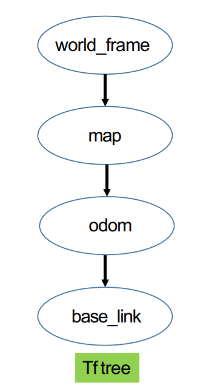
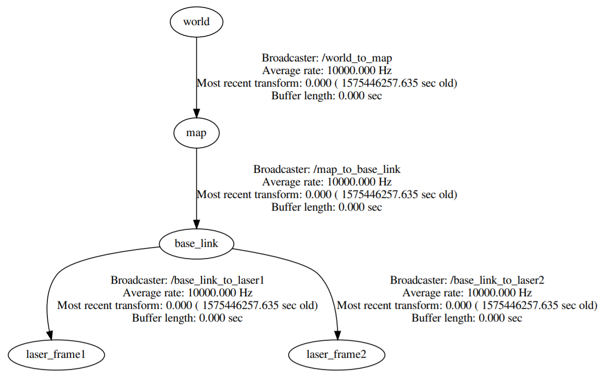

---
tags:
- coding
- ros
---
# Transform Frames

A frame in the ROS language is a specific coordinate system in the space. ROS abstracts elements of a robot as coordinates frames. Each physical part of a robot that has a particular meaning will most likely have its own frame :

- a sensor : *laser_frame*
- an arm : *left_arm_frame*

It is up to the programmer to create frames where it is necessary, but some frames are already defined by ROS (see below).

Each frame has it own origin and coordinate system :

{.center}

To keep trace of the frames in the whole coordinate system, they must all refer to a main frame. Knowing the position of the main frame and the relative positions of all the other frames, ROS is able to know the exact position of each frame all continuously.

The TF2 package tracks the coordinate frames. There are several predefined frames :

- *world* : kind of the parent of all the frames, does not move, there is only one single *world*
- *map* : child of *world*, can be freely fixed in the world frame, does not move compared to the *world*, but it can be several *map* frames in a *world* (usually one *map* per robot)
- *odom* : child of *map*, fixed at the start point of the robot in the *map* frame, does not move compared to *world* and *map*
- *base_link* : kind of the reference frame of a robot, it is moving in *odom*, therefore moving in *map* and *world*
- ...

The TF tree shows the relations between the frames :

{.center}

One can create coordinate frames for each part of the robot that needs to be tracked, for example :

- *scanner_frame* : position of the scanner on a robot, somehow linked to the *base_link*
- *wheels_frame* : position of the wheels on a robot, somehow linked to the *base_link*

The links between the *base_link* and the other frames can be direct, or they can be relative to it via other frames.

They are linked together by TF (transform frames). TF can be either static, which means that the relation between two frames will never change (for example two sensors being fixed 1 meter away), or dynamic when the relation evolves in the time (for example the arm of a robot compared to its head).

Let us use the example our two LIDAR sensor : they are oriented in the same way, they are on the same table, the only difference being there is 2.15 meter between them. For this example, they will never move nor rotate. We can use the node *static_transform_publisher* to inform other nodes that will use their data of their relative position. We will also fix them in the *world*, *map* and *base_link* frame.

Since the *base_link* frame will not move neither, it will also be fixed to the *map* by a static transform. The static transformations are called as a node from a launcher :

``` xml
<launch>
      <!-- From world to map, same origin -->
      <node pkg="tf2_ros" type="static_transform_publisher" name="world_to_map"
            args="0 0 0 0 0 0 /world /map" />

      <!-- From map to base_link, fixed in this case -->
      <node pkg="tf2_ros" type="static_transform_publisher" name="map_to_base_link"
            args="0 0 0 0 0 0 /map /base_link" />

      <!-- From base_link to laser_frame1, position of the first lidar -->
      <node pkg="tf2_ros" type="static_transform_publisher" name="base_link_to_lidar1"
            args="0 0 0 0 0 0 /base_link /lidar1_frame" />

      <!-- From base_link to laser_frame2, position of the second lidar -->
      <node pkg="tf2_ros" type="static_transform_publisher" name="base_link_to_lidar2"
            args="-2.15 -0.01 0 0 0 0 /base_link /lidar2_frame" />
</launch>
```

Which will produce the following TF tree:

{.center}

The arguments are :

- translations in X, Y, Z
- rotations around X, Y, Z
- parent *frame_id*
- child *frame_id*

Each topic has a reference frame. This means that each message being published on a topic kind of contains the position "from where it comes". This is the *frame_id* parameter. The node that will published the data of the LIDAR shall publish them with the right *frame_id*, otherwise the TF tree will not be able to link all the TF together.

Documentation about frames and transformations can be found there :

- [tf2](http://wiki.ros.org/tf2)
