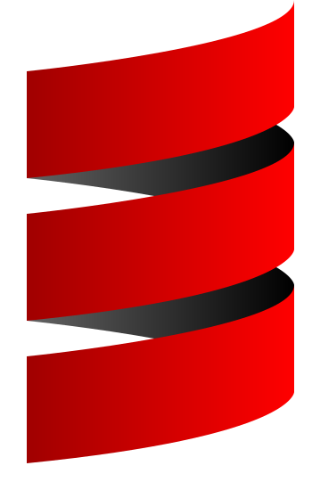
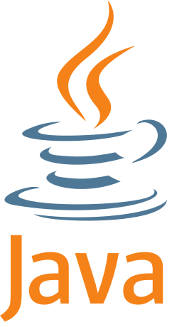
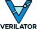

---
tags:
- coding
- spinal hdl
- hdl
---
# Tools

{.center width="150px"}

## Contents

- [GTKWave](gtkwave.md)
- [Intellij Idea](intellij_idea.md)

# Introduction

There are additional Tools needed for Spinal HDL to work. hereafter are named the most common with references for further studies.

## Programming Language

- [Scala](https://scala-lang.org/download/)
  {align=right width="10%"}

## Execution

- [Java SDK](https://www.oracle.com/technetwork/java/javase/downloads/jdk8-downloads-2133151.html)

  {align=right width="10%"}

- [Scala Build Tool SBT](https://www.scala-sbt.org/download.html)
  {align=right width="10%"}

## IDE

For writing and executing the scala code

- [Intellij IDEA](https://www.jetbrains.com/idea/)
  {align=right width="10%"}

## Simulator

Behind the scene SpinalHDL is generating a C++ cycle accurate model of your hardware by generating the equivalent Verilog and asking Verilator to convert it into a C++ model.

- [Verilator](https://www.veripool.org/wiki/verilator)
  - [Verilator Wiki](https://www.wikiwand.com/en/Verilator)
  {align=right width="10%"}

- [GTKWave](http://gtkwave.sourceforge.net/)
  {align=right width="10%"}

## Additional

- [MYSYS2](https://www.msys2.org/) for windows only
