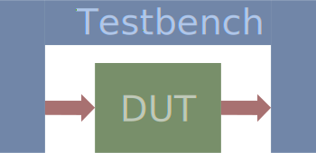

---
tags:
- coding
- vhdl
- simulation
---
# Simulation

{.center width="600px"}

Proposal of a simulation script system. All simulation files of a certain bloc can be found besides the `src` directory in the `sim` directory.

It needs to have at least 4 files

| Filename            | Description |
| ------------------- | -------------------------------------------------- |
| `<blocname>_tb.vhd` | Main Simulation Testbench Toplevel |
| `modelsim.ini`      | Modelsim configuration file with all necessary settings |
| `sim_main.do`       | Modelsim main simulation script |
| `sim_wave.do`       | Modelsim waveform file containing the needed waveforms |

## Configuring

### Testbench

First configure the testbench accordingly to your simulation.

- Constants
- Generics
- Sequence
- etc ...

### `sim_main.do`

The `sim_main.do` contains a user defined part and the rest will be the same for ever testbench. You only need to change the user changable part (see below).

| Variable     | Description                           | Example             |
|--------------|---------------------------------------|---------------------|
| `work_path`  | Path for all intermediate files. Can be anywhere, best is in a temporary folder  | `C:/temp`           |
| `sim_path`   | Path of the project sim folder you want to simulate    | `C:/work/Project/.../.../.../sim` |
| `wave_file`  | wave file to load after compilation   | `sim_wave_all.do`   |
| `sim_time`   | simulation time                       | `10 ms`, `10 us`, `10 sec`, `-all` |
| `file_list`  | list of all files to compile. Relative to the sim directory <br> Libraries <br> Subfiles <br> Mainfiles <br> Testbenchfiles     | see below           |
| `toplevel`   | Name of toplevel bloc (Main Testbench bloc | `interpolator_tb`   |

### Example

``` tcl title="sim_main.do" linenums="1"
#-------------------------------------------------------------------------------
# User changable parameters
# --
set work_path C:/temp/ricoh/ri_gen5/interpolator/work
set sim_path c:/work/project/Ricoh/2_FPGA/RI_GEN5/ip/interpolator/sim
set wave_file sim_wave.do
set sim_time "5 ms"

# filelist according to $simpath
set file_list {
                ../Interpolator_defs_pkg.vhd

                ../PulseGenerator.vhd
                ../RampCounter.vhd
                ../HwEncoder.vhd
                ../Interpolator.vhd

                Interpolator_tb.vhd
}

# Set toplevel entity
set toplevel interpolator_tb
# --
# END User changable parameters
#-------------------------------------------------------------------------------
```

### `sim_wave.do`

There can be a lot of different wvaeform files. In the `sim_main.do` you need to specify which one should be used. The waveform file needs to be created with modelsim.

- Add all the waves you want
- Configure the for each signal and it's display parameters
- Save the waveform file in the `sim` directory

### Launch simulation

- Open Modelsim and enter the following
  ``` tcl
  do C:/work/project/location/to/you/folder/sim/sim_script.do
  ```
- After compilation there will be a question in modelsim console to start the simulation.
  ``` tcl
  # Launch Simulation <Y|N y|n>
  ```