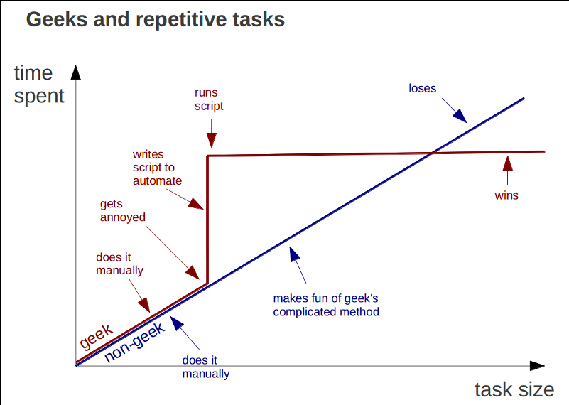
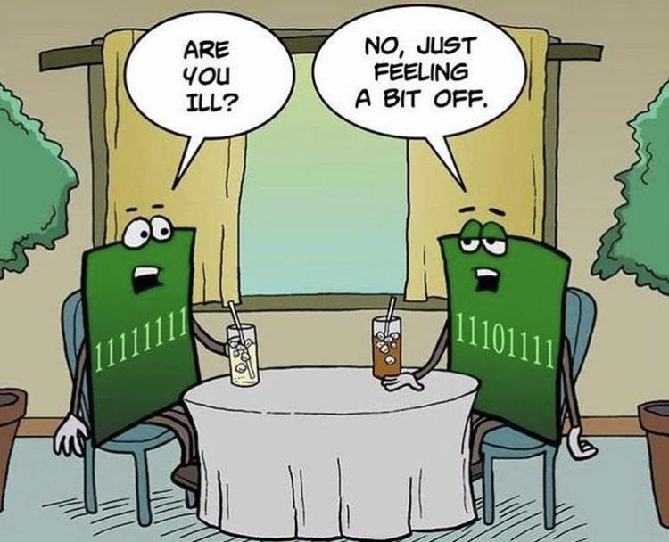

---
tags:
- multimedia
- text
- joke
---
# Programmer Jokes and Funny Facts
{.center width="20%"}

## Funy Facts

**Question** Why are programmers using `i`,`j`,`k`,\... as variables for `for` loops?

> **Answer** In Fortran every variable was a real number except the variables `i`,`j`,`k`,`l`,`m`,`n` which are considered integers.

**Question** Why do programmers start counting from zero?

> **Answer** If you want to access the first byte of a memory you have to use the `pointer + 0`.

**Question** Why has all codeeditors by default a limit of 80 character per line?

> **Answer** Punchcard in the past had only space for a 80 characters. So it was a very hard limit historically and has sticked.

## Christmas and Halloween

**Question** Why do programmers always mix up Halloween and Christmas?

> **Answer**
>
>  - 31 Dec Christmas
>  - 25 Okt Halloween

## 10 Kind of People

**Question** There are `10` types of people in this world. Those who understand binary and those who don't.

> **Answer** `0b10 = 2`

## Error Free Programs

**Question** There are two ways to write error-free programs; only the third one works.

> **Answer** There is no error free program, therefore the anwer is also wrong

## Boolean Answer

**Question** The best thing about a Boolean is even if you are wrong, you are only off by a bit.

> **Answer** Boolean = `0` or `1` only of by `1bit`

## Programmer Checks

**Question** A good programmer is someone who always looks both ways before crossing a one-way street.

> **Answer** Programmers can't make assumptions, they have to check everything

## Debugging

**Question** Debugging: Removing the needles from the haystack.

> **Answer** Debugging is removing bugs form a program. Bugs are hard to find like needles

## HTML Tags

**Question**


> **Answer** HTML Tags are wrong `DIV` and `SPAN` means the same. Above code is wrong.

## Teacher Punishement

**Question**


> **Answer** In this joke, his teacher probably gave him the punishment
>   "Write 'I will not throw paper airplanes in class.' on the board 500 times."

```
#include <stdio.h>
int main(void)
{
  int count;
  for (count = 1; count <= 500; count++)
  printf(“I will not throw paper airplanes in class.”);
  return 0;
}
```

## Accelerate a computer

**Question** The best method for accelerating a computer is the one that boosts it by $9.8 \frac{m}{s^2}$.

> **Answer** Let it drop. Earth gravity accelerates it by $9.8 \frac{m}{s^2}$

## SQL Naming

**Question**


> **Answer** This joke has to do with SQL, which are commands used to control databases as well as a common hack used against insecure sites, called SQL Injection.

## Scripts Automation




## Are you feeling ill?

**Question**



> **Answer** One bit is the smallest dataunit. Plays on the double meaning of "a bit" (a bit or one bit (data)).

## 19 Jan 2038 at 3:14:07 AM

**Question** What about 19 Jan 2038 at 3:14:07 AM? Remember Y2K? There's another date like it.

> **Answer** In Unix-like systems, time is measured as seconds since January 1, 1970. This time is often stored in a 32-bit signed integer. That means that dates can range between −2147483648 en 2147483647 seconds from 1970. So now you know what it is about 19 Jan 2038 at 3:14:07 AM, it's 2147483647 seconds after January 1, 1970!

## To be or not to be

{.center width="50%"}
