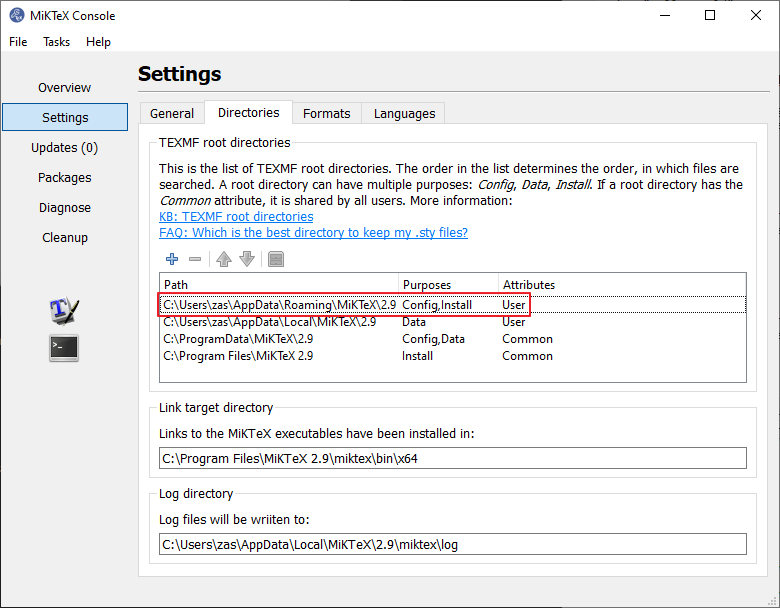

---
tags:
- multimedia
- writing
- latex
---
# Installation LaTeX
## Base Install

### Linux

| Package                   | > Archives  | Disk Space    |
|---------------------------|-------------|---------------|
| texlive‑latex‑base        | 59 MB       | 216 MB        |
| texlive‑latex‑recommended | 74 MB       | 248 MB        |
| texlive‑pictures          | 83 MB       | 277 MB        |
| texlive‑fonts‑recommended | 83 MB       | 281 MB        |
| texlive                   | 98 MB       | 314 MB        |
| texlive‑plain‑generic     | 82 MB       | > 261 MB      |
| texlive‑latex‑extra       | 144 MB      | 452 MB        |
| texlive‑full              | 2804 MB     | 5358 MB       |

see also [Tex StackExchange](https://tex.stackexchange.com/questions/245982/differences-between-texlive-packages-in-linux)

``` bash
texlive-latex-extra
   |   |   :   :
+-----------------+   |   :   :..................
|                     |   :                     :
v                     |   :                     v
texlive-pictures             |   :           texlive-plain-generic
|                     |   :
|    +----------------+   :...............
|    |                                   :
|    |              texlive              :
|    |               | | |               :
|    |    +----------+ | +----------+    :
|    |    |            |            |    :
v    v    v            |            v    v
texlive-latex-recommended     |  texlive-fonts-recommended
|            |            :
|            |            v
|            |           tipa
|            |            |
+----------+ | +----------+
      | | |
      v v v
texlive-latex-base
```

``` bash
sudo apt-get install texlive-latex-extra
```

### Windows

- Install MikTeX - <https://miktex.org/download>
- MikTeX Packages
  - minted
    ``` bash
    pip install pygments
    ```
    add Python Scripts to `PATH` Environment Variable.
    `%USERPROFILE%\AppData\Local\Continuum\anaconda3\Scripts\`
- Install TeXstudio
  - [TexStudio](https://texstudio.org)
  - Options =\> Configure TeXstudio =\> Commands =\> add Interpreter  Flag `-shell-escape`
    - enable line numbers
    - enable white spaces
- Install Inkscape
  - [Inkscape](https://inkscape.org/release/)

## Manual Package install
For manual installing `*.sty` Packages and `*.cls` Class files.

!!! tip
    For every package create a separate folder

### Manual Package Linux

- Find `TEXMFHOME` directory
  ``` bash
  kpsewhich -var-value TEXMFHOME
  ```
- Navigate to `$(TEXMFHOME)/tex/latex`
- Copy paste your `*.sty` and `*.cls`
- Update Package index
  ``` bash
  texhash
  ```

### Manual Package Windows

- Open MikTeX Console and go to `Settings -> Directories`
- The `Config,Install` and `User` folder is the location of your Packages: `%USERPROFILES%/AppData/Roaming/MikTeX/2.9/`
- Inside you have to navigate to `tex/latex/` folder
- `%USERPROFILES%/AppData/Roaming/MikTeX/2.9/tex/latex/`
    {width="70%"}
- Copy paste your `*.sty` and `*.cls`
- Update Package index
  ``` bash
  texhash
  ```