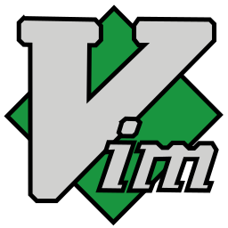

---
tags:
- os
- operating system
- linux
- tools
- vim
---
# VIM
{.center width="20%"}

Vim is a text editor written by Bram Moolenaar and first released publicly in 1991. Based on the vi editor common to Unix-like systems, Vim is designed for use both from a command line interface and as a standalone application in a graphical user interface.

## Cheat Sheet

The Vim Cheat Sheet was done by [http://michael.peopleofhonoronly.com/vim/](http://michael.peopleofhonoronly.com/vim/).


## SWP Files

If working remotely Vim generated swap file. If you're sure that your work is safely storey you can get rid of the swapfiles with the following commands:

``` bash
find . -name ".*.swp"                # find swap files
find . -name ".*.swp" | xargs rm -f  # find and delete
```

## Commands

### Edit & Save & Quit

| Command             | Description |
|---------------------|-------------|
| `:e <filename>`     | Open and **e**dit `<filename>` |
| `:w`                | **w**rite file |
| `:w <filename>`     | **w**rite file in `<filename>` |
| `:wq`               | **w**rite and **q**uit |
| `:wq <filename>`    | **w**rite file in `<filename>` and **q**uit |
| `:wq!`              | **w**rite and **q**uit |

### File

| Command             | Description |
|---------------------|-------------|
| `:ls`               | **l**i**s**t current buffers & files |
| `:e`                | Open integrated File **e**xplorer |
| `:Sex`              | **S**plit windows and open integrated File **ex**xlorer |

### Tab

open multiple files as tabs in vim >7.0

``` bash
vim -p file1 file2 file3
```

| Command             | Description |
|---------------------|-------------|
| `:tabe <filepath>`  | **tab**ulator **e**dit (add file as new tab) |
| `:tabn`             | **tab** **n**ext |
| `:tabp`             | **tab** **p**revious |
| `gt`                | **g**oto next **t**ab |
| `gT`                | **g**oto previous **t**ab |

### Split screen

| Command             | Description |
|---------------------|-------------|
| `:sb <filepath>`    | Add file in horizontal split |
| `:vs <filepath>`    | Add file in **v**ertical **s**plit |
| `^w <arrow>`        | Jump to screen in the arrow direction |

### Search

[Regex](../../../coding/regex/index.md)

| Command              | Description |
|----------------------|-------------|
| `<regex>`            | Search for a [Regex](../../../coding/regex/index.md) pattern |
| `:noh`               | Stop Highlight search results |
| `AltGr + #`          | Search/Highlight current word |
| `/word`              | Search word from top to bottom |
| `?word`              | Search word from bottom to top |
| `/jo[ha]n`           | Search john or joan |
| `/\< the`            | Search the, theatre or then |
| `/the\>`             | Search the or breathe |
| `/\< the\>`          | Search the |
| `/fred\|joe`         | Search fred or joe |
| `/\<\d\d\d\d\>`      | Search exactly 4 digits |
| `/^\n\{3}`           | Find 3 empty lines |
| `:bufdo /searchstr/` | Search in all open files |

### Replace

| Command              | Description |
|----------------------|-------------|
| `:%s/<regex>/replacer/cmd` | Replace [Regex](../../../coding/regex/index.md) search with replacer |
| `:%s/foo/bar/g`            | replace foo with bar auto |
| `:%s/foo/bar/gc`           | replace foo with bar ask **c**onfirmation |

### Modes

| Command              | Description |
|----------------------|-------------|
| `i`                  | **I**nsert Mode |
| `R`                  | **R**eplace Mode |
| `a`                  | **A**ppend Mode |
| `v`                  | **V**isual Mode |
| `V`                  | **V**isual Line Mode |
| `Ctrl` + `v`         | **V**isual Block Mode |
| `u`                  | **U**ndo |

### Edit

| Command              | Description |
|----------------------|-------------|
| `d`                  | **D**elete (also used as Cut) |
| `D`                  | **D**elete to eol (also used as Cut to eol) |
| `y`                  | **Y**ank (copy) |
| `Y`                  | **Y**ank (copy) line |
| `<`                  | shift left (marked lines) |
| `>`                  | shift right (marked lines) |

### Macro

| Command               | Description |
|-----------------------|-------------|
| `q <macroname>`       | 1 start recording <macroname> = lowercase letter |
| `to what you want`    | 2 Perform the repetetive editing |
| `q`                   | 3 Stop recording |
| `@ <macroname>`       | 4-1 Play recording <macroname> = lowercase letter from before |
| `<nbr> @ <macroname>` | 4-2 Play recording multiple times <nbr> = number of times |

### Console

Execute a console command. Vim will be halted and the console from within Vim was opened will execute the program and go back to Vim after execution is complete.

| Command               | Description |
|-----------------------|-------------|
| `:!<console command>` | Executes command in the console |

# .vimrc

``` title=".vimrc" linenums="1"
set nocp

set autoindent
set backspace=2
set backup
set hidden
set history=500
set hlsearch
set incsearch
set listchars=precedes:$,extends:$,tab:>-,trail:.,eol:<
" Line numbers "
set number
set printheader=%<%F%=Seite\ %N
set ruler
set shiftwidth=2
set showcmd
set showmatch
set showmode
set sidescroll=5
set smartcase
set smartindent
set softtabstop=2
set spelllang=de,en
set spellsuggest=double,10
set statusline=%<%f\ %h%m%r%=%([%{Tlist_Get_Tagname_By_Line()}]%)\ #%n\ %-14.(%l/%L,%c%V%)\ %P
set tabstop=2
" set textwidth=75 "
set title
set wildmenu
set wildmode=list:longest,full

" Use Windows Clipboard "
if has("win32")
    set clipboard=unnamed
endif

" Syntax Highlighting "
syntax on

" Filename Detection
filetype on
filetype indent on
filetype plugin on

" Folding
"syntax sync fromstart
set foldmethod=indent
set nofoldenable
```

Download my [.vimrc]({{config_repo_file}}/config/home/zac/.vimrc)
