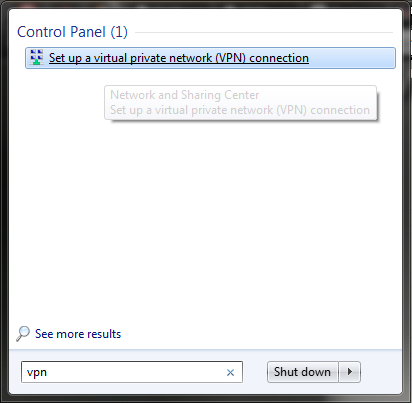
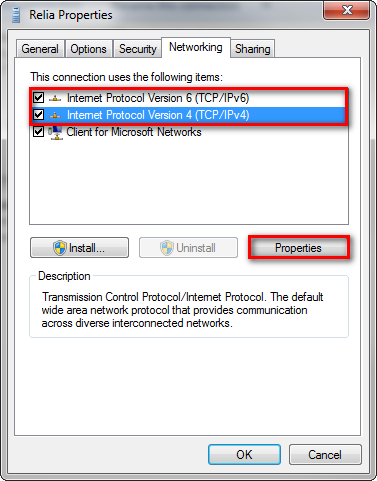
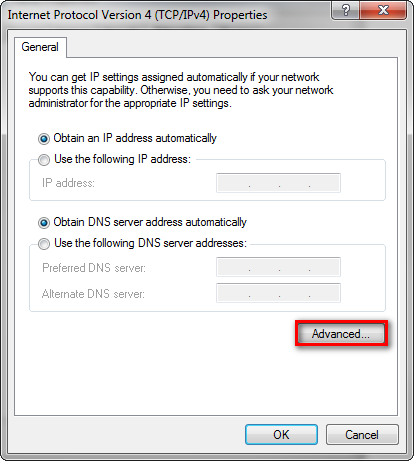
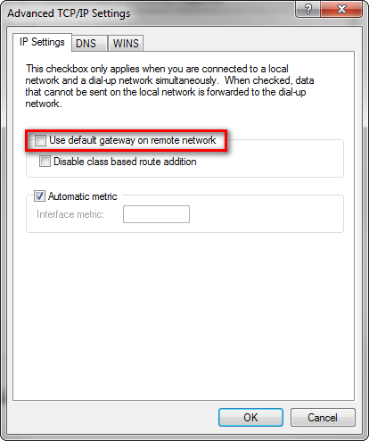

---
tags:
- os
- operating system
- linux
- tools
- vpn
---
# VPN Virtual Private Network

A virtual private network (VPN) extends a private network across a public network, such as the Internet. It enables a computer to send and receive data across shared or public networks as if it were directly connected to the private network, while benefiting from the functionality, security and management policies of the private network. This is done by establishing a virtual point-to-point connection through the use of dedicated connections, encryption, or a combination of the two.

There exist many different VPN protocols such as PPTP, OpenVPN, L2TP, SSTP. In this section We will set-up and connect a VPN connection using the PPTP protocol.

## VPN Server Outgoing (Linux)

### Install

``` bash
sudo apt-get install pptpd
```

### Config

Add the following lines in your `etc/pptpd.conf`

``` bash title="/etc/pptpd.conf"
localip  192.168.1.5         # IP of your server hosting VPN
remoteip 192.168.1.234-1.238 # Range of IP to use for connected machines
```

Add the following lines to configure `pptpd` in `/etc/ppp/pptpd-options`

``` bash title="/etc/ppp/pptpd-options"
ms-dns 192.168.1.1        # IP of your DNS Server
nobsdcomp
noipx
mtu 1490
mru 1490
```

add users to the `/etc/ppp/chap-secrets` file, you can add as many users as you like

``` bash title="/etc/ppp/chap-secrets"
username * users-password *
```

### Start VPN

Start / Restart the VPN Deamon to activate the config

``` bash
sudo /etc/init.d/pptpd restart
```

!!! tip
    Note that the connection can only access the server itself and not beyond it. Enable forwarding to avoid this.

### Enable Forwarding

This step is optional. It is needed to give the connected machine access beyond the server.

By enable forwarding the entire network will be available to the connected machine not just the VPN server itself.

Edit the `/etc/sysctl.conf` and change to following parameter from `0` to to `1`

``` bash title="/etc/sysctl.conf"
net.ipv4.ip_forward=1
```

To active the setting either restart the server or run the command:

``` bash
sudo sysctl -p
```

## VPN client Incoming (Win 7)

See the print screens to how to setup the VPN incoming connection on Windows 7.

!!! note
    If VPN is setup by default to relay all traffic through the VPN connection. To avoid this you need to uncheck.

{.center}

{.center}

{.center}

{.center}

{.center}

{.center}
